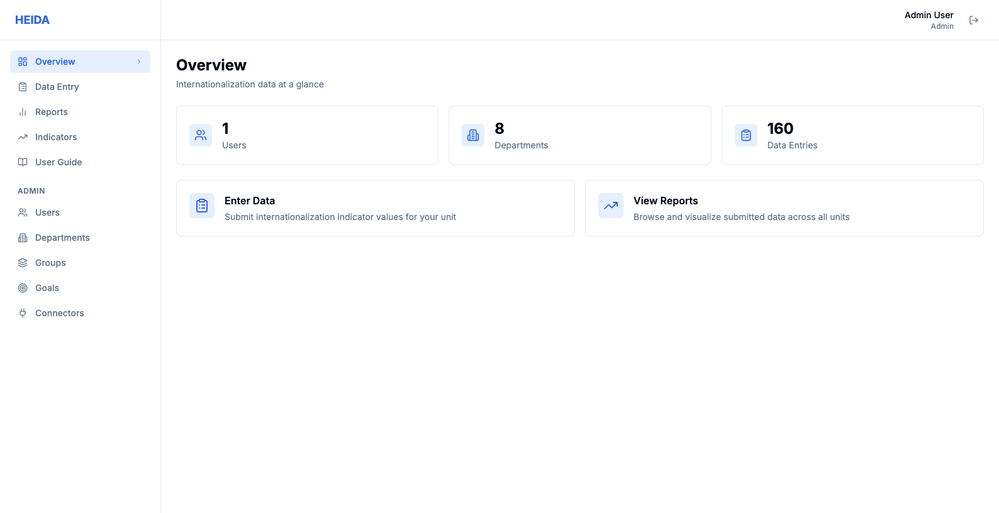
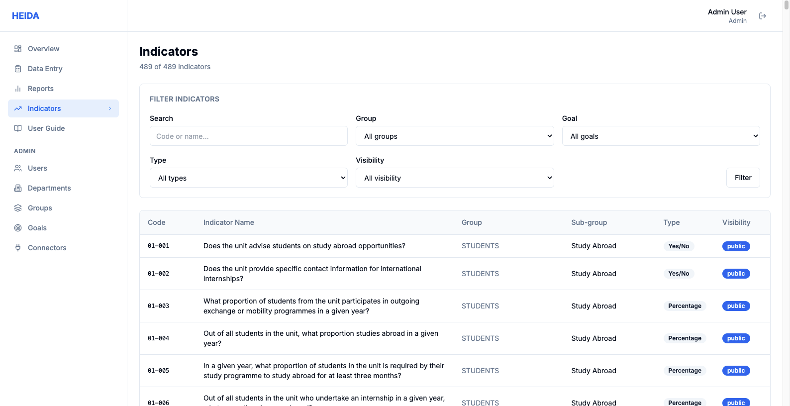
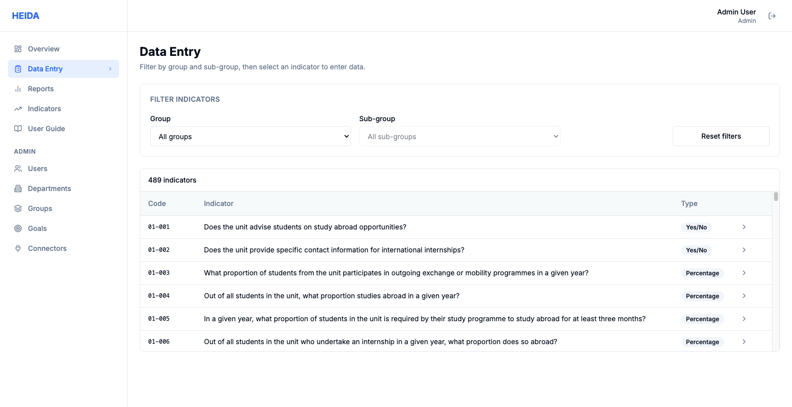
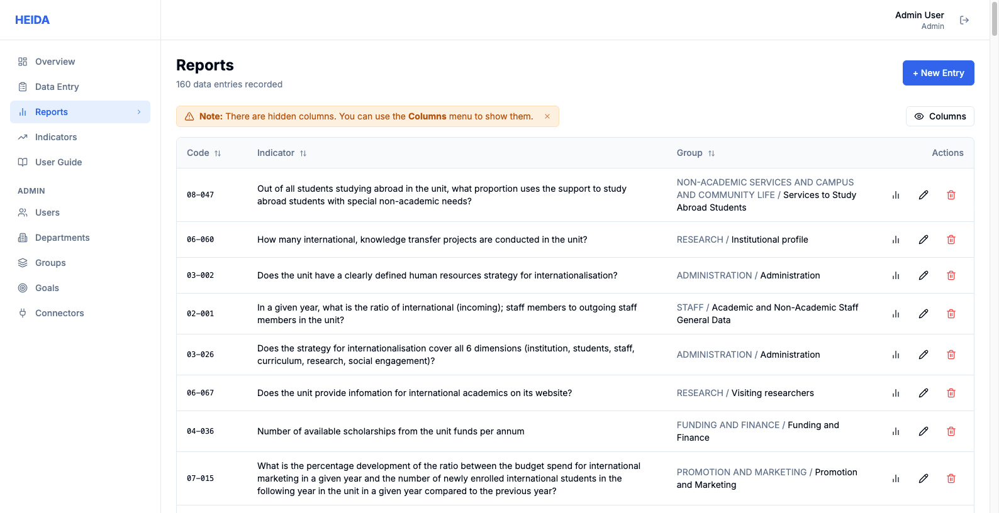
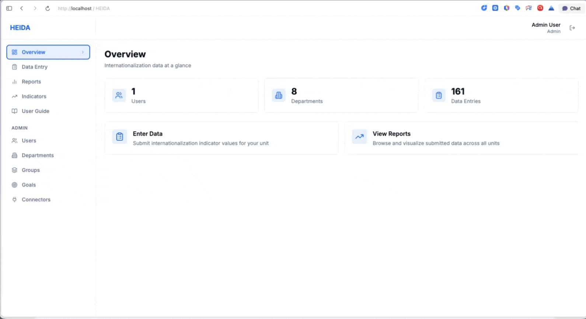

# HEIDA v2 (Experimental)



**Data-driven decision making for the internationalization of higher education — Powered by AI.**

HEIDA is a modern web application that helps academic institutions collect, track, and visualize internationalization indicators across faculties, colleges, and administrative units. This version is a full architectural rewrite of the original HEIDA platform, designed to be inherently AI-ready and high-performance.

> [!NOTE]
> This is an **experimental rewrite** of the HEIDA platform. It was built using a collaboration of human developer expertise and advanced AI coding assistants: **Claude Code Sonnet 4.6**, **Gemini 3.1 Pro**, and **Antigravity**.

---

## Tech stack

| Layer | Choice |
|---|---|
| **Framework** | Next.js 14 (App Router, TypeScript) |
| **Database** | PostgreSQL 16 (Neon / Docker) |
| **ORM** | Drizzle ORM |
| **Auth** | NextAuth v5 (Auth.js) |
| **AI Protocol** | Model Context Protocol (MCP) |
| **Styling** | Tailwind CSS + shadcn/ui primitives |
| **Charts** | Recharts |

---

## Visual Overview

### Indicators & Data Management

*Browse and manage all 489 internationalization indicators.*

### Efficient Data Entry

*Streamlined workflow for submitting unit-level data.*

### Dynamic Reports & Analytics

*Visualize trends with real-time charts and exportable tables.*

---

## Workflows in Action

### User Experience & Navigation


### Administrative Role Management


---

## AI Integration (MCP)

HEIDA v2 includes a built-in MCP server that exposes secure tools to AI clients. This allows you to chat with your institutional data directly in tools like Claude Desktop or Cursor.

### Available AI Tools:
- `list_strategic_goals`: Retrieves the current strategic roadmap.
- `search_indicators`: Finds indicator IDs by name or code.
- `get_historical_data`: Optimized bulk retrieval of year-value pairs for any indicator.

### Getting Connected:
Visit the **Connectors** page in the Admin dashboard to generate a 1-click JSON configuration snippet for your AI client.

---

## Getting started

### Prerequisites
- Node.js 20+
- Docker (for local development)

### 1. Install dependencies
```bash
npm install
```

### 2. Set up environment variables
Copy `.env.example` to `.env.local` and fill in your database and auth secrets.

### 3. Start the database
```bash
docker compose up -d db
```

### 4. Push and Migrate the schema
```bash
npm run db:generate
npm run db:migrate
```

### 5. Seed with real data
```bash
npm run db:seed
```
Default admin: `admin@heida.local` / `admin123`

---

## Project structure

```
src/
├── app/
│   ├── actions/               # Server Actions with Zod validation
│   ├── dashboard/
│   │   ├── admin/             # Admin console (MCP, Users, Goals, etc.)
│   │   ├── data/              # Data entry workflow
│   │   └── reports/           # Live charts and tables
│   └── api/mcp/               # MCP SSE & Message endpoints
├── db/
│   ├── schema/                # Indexed PostgreSQL tables
├── lib/
│   ├── mcp.ts                 # MCP Server logic & Tool definitions
│   └── constants.ts           # Shared role & permission logic
```

---

## Contributors

| Contributor | Role |
|---|---|
| [Emin Devrim Fidan](https://github.com/devrimfidan) | Lead developer, architecture, domain design |
| [Claude Sonnet 4.6](https://claude.ai) | AI pair programmer — code review, security hardening, MCP integration |

---

## License
Experimental rewrite based on the European Commission funded project — Koc University. Built with AI.
